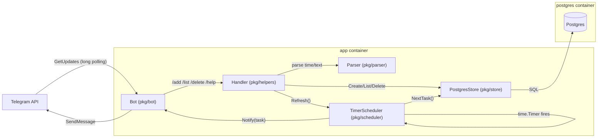

## Компоненты

- **Telegram** — источник и получатель сообщений.
- **Bot (`pkg/bot`)**
  - long polling через `GetUpdates`
  - роутинг команд в handler
  - отправка сообщений в Telegram
- **Handler (`pkg/helpers`)** — обработка команд `/add`, `/list`, `/delete`, `/help`.
- **Parser (`pkg/parser`)** — парсинг `DD.MM.YY hh:mm` и текста.
- **Store (`pkg/store`)** — Postgres-хранилище задач.
- **Scheduler (`pkg/scheduler`)** — один `time.Timer` + `Refresh()`.
  - берёт ближайшую задачу через `Store.NextTask()`
  - ставит таймер до `DueAt`
  - при срабатывании вызывает `Bot.Notify()`
  - при успехе удаляет задачу и пересчитывает следующую

## Диаграмма (runtime)

## Docker Compose

`docker-compose.yml` поднимает два сервиса:
- `postgres` (порт 5432 наружу, volume `pgdata`)
- `app` (сборка из `Dockerfile`, переменные из `.env`)

Критично: внутри контейнера `app` `DB_HOST` должен быть `postgres` (имя сервиса в compose-сети).
